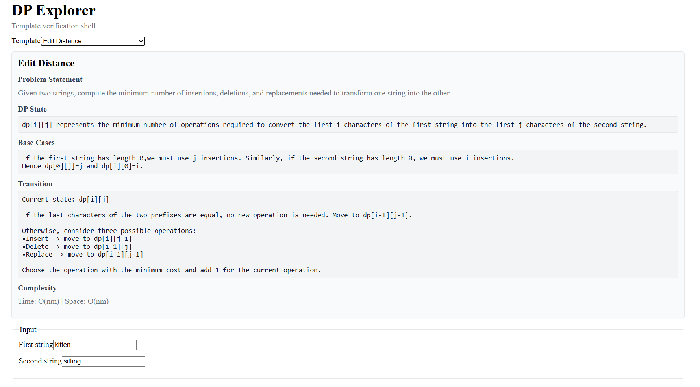
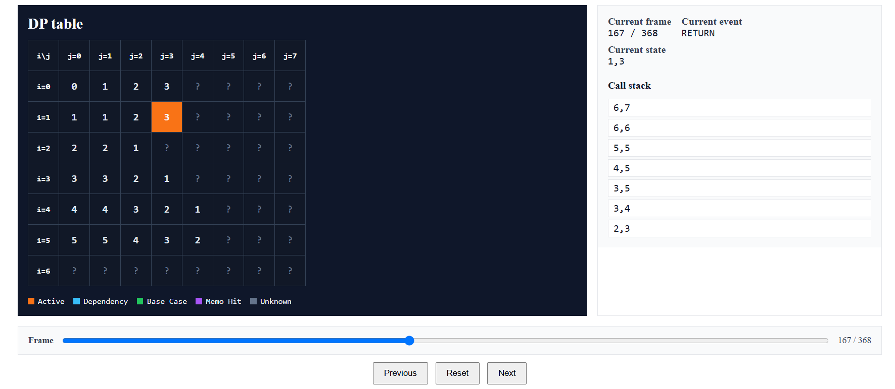

# DP Explorer

> **Design, compile, execute, and visualize dynamic programming algorithms.**

DP Explorer is a compiler-backed educational platform for Dynamic Programming.

Unlike traditional DP visualizers that animate a fixed collection of algorithms, DP Explorer allows users to **define their own dynamic programming recurrences**, compile them into executable specifications, and visualize their execution through a generic runtime.

The project combines a specification builder, compiler, execution engine, playback system, and visualization layer into a unified learning platform.

---

## Why DP Explorer?

Dynamic Programming is often taught as a collection of formulas to memorize.

DP Explorer instead focuses on the reasoning process.

Users can:

- Design custom dynamic programming specifications
- Compile mathematical recurrences into executable runtime objects
- Execute the same specification using both top-down and bottom-up evaluation
- Observe execution through synchronized visualizations
- Understand how every state, dependency, and transition contributes to the final answer

The goal is to help learners understand **why** a dynamic programming algorithm works—not simply what answer it produces.

---

# Application Screenshots




# Features

## Specification Builder

- Interactive Builder for dynamic programming specifications
- Custom state variables
- Primitive and array runtime inputs
- Base cases
- Transitions
- Root state
- Initial DP values
- Answer expressions

---

## Specification Compiler

Transforms Builder specifications into executable `ProblemSpec`s.

Compilation pipeline:

```
BuilderState

↓

Parser

↓

Semantic Validator

↓

ProblemSpec Generator

↓

ProblemSpec
```

---

## Generic Runtime

A single runtime executes every supported specification.

Supported execution modes:

- Top-Down (memoized recursion)
- Bottom-Up (tabulation)

The runtime itself contains no problem-specific logic.

---

## Playback Engine

- Deterministic execution replay
- Timeline navigation
- Frame-by-frame playback
- Immutable execution traces

---

## Visualization

- DP table visualization (1D and 2D)
- Recursion tree (Top-Down)
- Timeline
- Runtime statistics
- Answer panel

Specifications with higher-dimensional state spaces execute correctly while displaying an informational message in place of the DP table.

---

# Architecture

```
             Specification Builder
                      │
                      ▼
                BuilderState
                      │
                      ▼
           Specification Compiler
                      │
                      ▼
                 ProblemSpec
                      │
           ┌──────────┴──────────┐
           ▼                     ▼
    Top-Down Runtime      Bottom-Up Runtime
           │                     │
           └──────────┬──────────┘
                      ▼
              Execution Trace
                      │
                      ▼
             Playback Engine
                      │
                      ▼
             Visualization UI
```

---

# Example Workflow

```
Define a DP

↓

Compile

↓

Execute

↓

Replay

↓

Visualize
```

The runtime never distinguishes between handwritten templates and Builder-generated specifications.

Every algorithm executes through the same `ProblemSpec` abstraction.

---

# Project Structure

```
apps/

    web/
        Builder
        Visualization

packages/

    core/
        Runtime

    playback/
        Playback Engine

    spec-compiler/
        Parser
        Validator
        Generator

    templates/
        Built-in DP specifications
```

---

# Getting Started

```bash
pnpm install

pnpm build

pnpm dev
```

The web application is available at

```
http://localhost:5173
```

---

# Documentation

The repository contains detailed documentation for every subsystem.

| Document           | Description                 |
| ------------------ | --------------------------- |
| `ARCHITECTURE.md`  | Overall system architecture |
| `COMPILER.md`      | Specification compiler      |
| `LANGUAGE.md`      | Builder language            |
| `PROBLEM_SPEC.md`  | Runtime abstraction         |
| `PLAYBACK_SPEC.md` | Playback engine             |
| `FRAME_SPEC.md`    | Execution frame model       |
| `UI_SPEC.md`       | User interface              |
| `ROADMAP.md`       | Planned future work         |

---

# Current Status

**Version 1.5**

Implemented:

- Specification Builder
- Compiler
- Runtime
- Playback Engine
- Visualization
- Documentation

The next major milestone introduces a propagation-based execution engine for accumulation-style dynamic programming.

See `ROADMAP.md` for future plans.

---

# License

This project is released under the MIT License.
